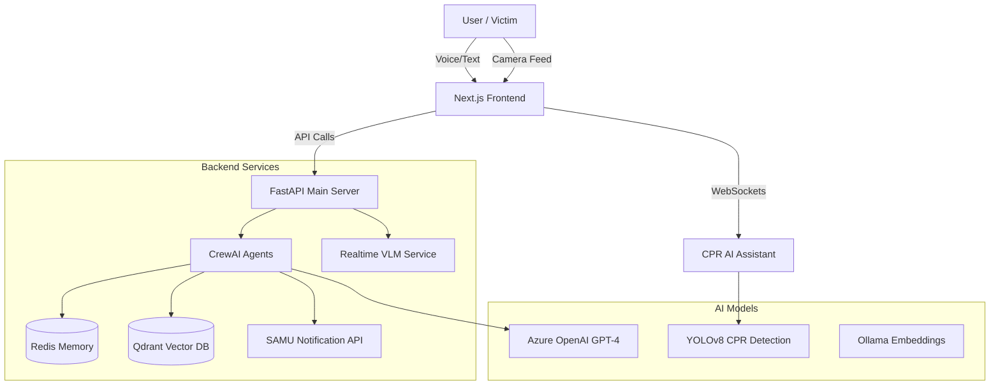

# 🚑 Monkedh - AI Emergency First Aid Assistant

**Monkedh** is a next-generation emergency response system designed for the **Tunisian context**. It leverages advanced AI agents, Computer Vision, and Real-time Communication to provide immediate, life-saving guidance during medical emergencies.

The system integrates a **CrewAI-powered backend**, a **Next.js frontend**, and specialized modules for **CPR assistance** and **Video Analysis**.

---

## 🌟 Key Features

### 🧠 Intelligent Multi-Agent Chatbot
- **Context-Aware**: Understands Tunisian dialects and specific emergency context.
- **RAG System**: Retrieves accurate medical protocols from official manuals.
- **Silent SAMU Delegation**: Automatically notifies emergency services (190) with structured reports without interrupting the user flow.

### 🗣️ Real-Time Voice Interaction
- Hands-free voice mode powered by **Azure OpenAI GPT-Realtime**.
- Natural conversation flow for high-stress situations.

### 📹 Vision & Video Analysis
- **CPR Assistant**: AI-powered camera tool that monitors CPR quality (rate, depth) and provides real-time feedback (uses YOLO/PyTorch).
- **Video Report**: Analyzes crash or emergency videos to generate detailed incident reports using VLM (Vision Language Models).

### 🖥️ Operator Dashboard
- Real-time dashboard for SAMU operators to view incoming alerts, location data, and patient status.

---

## 🏗️ Architecture

The project is divided into a **Backend** (Python microservices) and a **Frontend** (Next.js application).



---

## 🛠️ Tech Stack

### Frontend (`/frontend`)
- **Framework**: [Next.js 16](https://nextjs.org/) (App Router)
- **Language**: TypeScript / React 19
- **UI Library**: [Radix UI](https://www.radix-ui.com/), [Tailwind CSS](https://tailwindcss.com/)
- **Animations**: [Framer Motion](https://www.framer.com/motion/)
- **AI Integration**: [CopilotKit](https://docs.copilotkit.ai/)

### Backend (`/backend`)
- **Core Framework**: [FastAPI](https://fastapi.tiangolo.com/)
- **AI Agents**: [CrewAI](https://crewai.com/)
- **LLM Provider**: Azure OpenAI (GPT-4), Ollama (Local Embeddings)
- **Vector DB**: [Qdrant](https://qdrant.tech/)
- **Memory**: Redis
- **Computer Vision**: [PyTorch](https://pytorch.org/), [YOLOv8](https://github.com/ultralytics/ultralytics) (for CPR), CLIP (Image Search)

---

## 🚀 Getting Started

### Prerequisites

- **Node.js** v18+ and **npm/pnpm**
- **Python** 3.10 - 3.12
- **Redis** server (Local or Cloud)
- **Ollama** (for local embeddings - optional but recommended)
- **API Keys**: Azure OpenAI, Serper (Google Search)

### 1️⃣ Installation

#### Backend Setup

1.  Navigate to the assistant directory:
    ```bash
    cd backend/assistant
    ```
2.  Create a virtual environment:
    ```bash
    python -m venv venv
    # Windows
    .\venv\Scripts\Activate
    # Linux/Mac
    source venv/bin/activate
    ```
3.  Install dependencies:
    ```bash
    pip install -r requirements.txt
    ```
4.  (Optional) For CPR Assistant:
    ```bash
    cd ../cpr_assistant
    pip install -r requirements.txt
    ```

#### Frontend Setup

1.  Navigate to the frontend directory:
    ```bash
    cd frontend
    ```
2.  Install dependencies:
    ```bash
    npm install
    # or
    pnpm install
    ```

### 2️⃣ Configuration

Create a `.env` file in `backend/assistant/.env` with your API keys:

```env
# Azure OpenAI
AZURE_API_KEY=your_key
AZURE_API_BASE=https://your-resource.openai.azure.com/
AZURE_API_VERSION=2024-12-01-preview
model=azure/gpt-4-deployment

# Redis
REDIS_HOST=localhost
REDIS_PORT=6379

# Search Tools
SERPER_API_KEY=your_serper_key
```

Create a `.env.local` in `frontend/.env.local` if needed for frontend-specific keys (e.g., Maps API, Public backend URL).

---

## 🏃‍♂️ Usage

### Running the Backend (AI Agents)

To start the main CLI chatbot or the backend API:

```bash
# In backend/assistant/
python -m monkedh.main          # Text Chat CLI
python -m monkedh.main --voice # Voice Mode
```

To run the API server for the frontend:

```bash
# In backend/assistant/ (or root depending on path config)
python backend/main.py
```

### Running the Frontend

```bash
cd frontend
npm run dev
```

Visit `http://localhost:3000` to access the web application.

### Running CPR Assistant

```bash
cd backend/cpr_assistant
python api_server.py
```

---

## 📂 Project Structure

- **`backend/`**
    - **`assistant/`**: The core CrewAI logic, RAG implementation, and tools.
    - **`cpr_assistant/`**: Computer vision logic for CPR monitoring.
    - **`realtime_vlm/`**: Microservices for video report generation.
- **`frontend/`**
    - **`app/`**: Next.js App Router pages (Chat, Video Report, etc.).
    - **`components/`**: Reusable UI components.

---

## 🤝 Contributing

Contributions are welcome! Please ensure you follow the existing code style and structure.

## 📄 License

This project is licensed under the MIT License.

---

**Author**: Youssef Benlallahom
