# 🚑 Monkedh: Emergency First Aid Assistant

> **Your AI-powered companion for emergency response in Tunisia.**
> *Prototype / Research Project*

 
 


## 📌 Overview

**Monkedh** is a comprehensive emergency assistant designed to provide immediate guidance and support during medical emergencies. It combines real-time AI analysis, voice interaction, and computer vision to assist users effectively, tailored for the Tunisian context.

### 🌟 Key Features

| Feature | Description |
| :--- | :--- |
| **💬 AI Chat Assistant** | Intelligent chat powered by **CrewAI** offering immediate first-aid advice. |
| **🎙️ Voice Interaction** | Hands-free voice mode with real-time speech-to-text and text-to-speech (Azure Realtime). |
| **📹 Realtime Video Analysis** | Analyzes live video feeds to detect hazards or assess situations. |
| **🫀 CPR Assistant** | Live feedback on CPR performance using computer vision (**YOLO**). |
| **📄 Automated Reports** | Generates detailed incident reports from video footage for medical professionals. |
| **📚 RAG Knowledge Base** | Access to verified first-aid protocols and manuals using **Qdrant**. |
| **🇹🇳 Local Context** | Integrated with Tunisian emergency numbers (SAMU 190, Civil Protection 198). |

---

## 🏗️ Architecture

```mermaid
graph TD
    subgraph Frontend ["📱 Frontend (Next.js)"]
        UI[Web UI]
        Voice[Voice Module]
        Cam[Camera Feed]
    end

    subgraph Backend_Assistant ["🧠 Assistant Backend (FastAPI)"]
        API[REST API]
        Crew[CrewAI Agent]
        RAG[RAG Engine]
        Redis[(Redis History)]
        Qdrant[(Qdrant Vector DB)]
    end

    subgraph Backend_CPR ["🫀 CPR Backend (Flask)"]
        CPR_API[Socket.IO Server]
        YOLO[YOLO Model]
    end

    subgraph Backend_VLM ["👁️ Realtime VLM (Docker)"]
        VLM_Orch[Orchestrator]
        Vision[Vision Model]
    end

    UI --> API
    Voice --> API
    Cam -- Stream --> CPR_API
    UI --> VLM_Orch
    API --> Crew
    Crew --> RAG
    RAG --> Qdrant
    API --> Redis
    CPR_API --> YOLO
```



---

## 🚀 Quick Start

Follow these steps to get the system running locally.

### Prerequisites
- **Node.js** & **npm**
- **Python 3.10+**
- **Docker** (optional, for VLM backend)
- **Redis** server running locally

### 1️⃣ Assistant Backend Setup (FastAPI)
```powershell
cd backend/assistant

# Create and activate virtual environment
python -m venv .venv
.\.venv\Scripts\Activate.ps1

# Install dependencies and package
pip install -e .

# Run the server
python -m monkedh.api
```
* The API will listen on `http://localhost:8000`
* Interactive API docs available at `http://localhost:8000/docs`

### 2️⃣ Frontend Setup (Next.js)
```powershell
cd frontend

# Install dependencies
npm install

# Run development server
npm run dev
```
* Open `http://localhost:3000` in your browser.

### 3️⃣ (Optional) CPR Camera Backend
Required for the CPR feedback feature.
```powershell
cd backend/cpr_assistant
python -m venv .venv
.\.venv\Scripts\Activate.ps1
pip install -r requirements.txt
python api_server.py
```
* Listens on `http://localhost:5000`

---

## ⚙️ Configuration

You need to configure environment variables for the system to work correctly.

<details>
<summary><strong>📋 Backend Environment (`backend/assistant/.env`)</strong></summary>

Create a file named `.env` in `backend/assistant/`:

```env
# Azure OpenAI (CrewAI LLM)
AZURE_API_KEY=your_key
AZURE_API_BASE=https://<your-resource>.openai.azure.com/
AZURE_API_VERSION=2024-02-15-preview
model=azure/<your-deployment-name>

# Redis (History)
REDIS_HOST=localhost
REDIS_PORT=6379

# Azure Realtime (Voice)
AZURE_REALTIME_API_KEY=your_key
AZURE_REALTIME_API_BASE=your_base_url
```
</details>

<details>
<summary><strong>📋 Frontend Environment (`frontend/.env.local`)</strong></summary>

Create a file named `.env.local` in `frontend/`:

```env
NEXT_PUBLIC_API_URL=http://localhost:8000
NEXT_PUBLIC_BACKEND_URL=http://localhost:5000
NEXT_PUBLIC_REALTIME_VLM_URL=http://localhost:8000
```
</details>

---

## 🛠️ Tech Stack

| Component | Technologies |
| :--- | :--- |
| **Frontend** |     |
| **Backend** |    |
| **AI & ML** |     |
| **Data & Infra** |    |

---

## ⚠️ Emergency Disclaimer

**This application is for educational and research purposes only.** It is a prototype and should not be relied upon in a critical life-or-death situation.

**In case of real emergency in Tunisia:**
*   🚑 **SAMU: 190**
*   🚒 **Protection Civile: 198**
*   🚓 **Police: 197**
